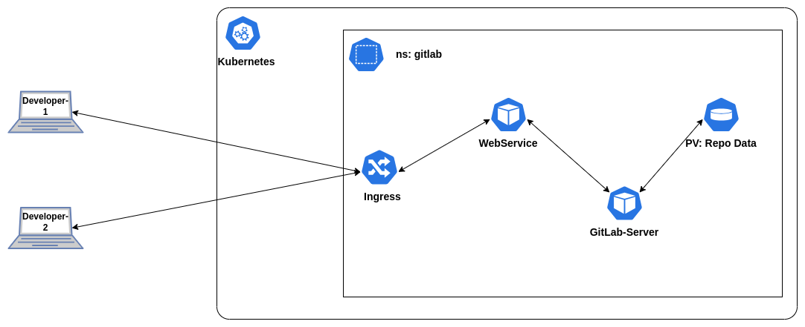

# GitLab v16.7.3 - Nginx Ingress (SSL) - Kind v1.25.1

## Architecture


# Get Started

## Setup K8s Cluster
1. Let's create K8s v1.25.1 `poc-gitlab` using kind.
```shell
kind create cluster --name poc-gitlab --image kindest/node:v1.25.1 --config kind/config.yaml
kubectl get nodes
```
2. Install metal-lb
```shell
kubectl apply -f https://raw.githubusercontent.com/metallb/metallb/v0.13.7/config/manifests/metallb-native.yaml
kubectl wait --namespace metallb-system \
            --for=condition=ready pod \
            --selector=app=metallb \
            --timeout=90s
kubectl -n metallb-system get all
```
3. Configure IP addresses in [kind/metallb-ip-pool.yaml](./kind/metallb-ip-pool.yaml) and deploy metalLB IP address pool.
```shell
# Inspect docker network(kind) IP address range.
docker network inspect -f '{{.IPAM.Config}}' kind

# Configure IP address range in kind/metallb-ip-pool.yaml
kubectl apply -f kind/metallb-ip-pool.yaml
```

## Install GitLab
1. Add `GitLab` helm repo to local machine.
```shell
helm repo add gitlab https://charts.gitlab.io/
helm repo update
```
2. Search the `GitLab` helm chart versions
```shell
helm search repo gitlab/gitlab -l
helm search repo gitlab/gitlab --version 7.7.3
```
3. Get the values of `gitlab/gitlab` chart version `7.7.3`
```shell
helm show values gitlab/gitlab --version 7.7.3 > v7.7.3-values.yaml
```
4. Modify [v7.7.3-values.yaml](./v7.7.3-values.yaml) file as per the requirement and check template
```shell
helm template app gitlab/gitlab --version 7.7.3 -f v7.7.3-values.yaml > manifest.yaml
```
5. Deploy `gitlab/gitlab` chart with [v7.7.3-values.yaml](./v7.7.3-values.yaml) file
```shell
helm upgrade --install app gitlab/gitlab \
    --version 7.7.3 \
    -n gitlab --create-namespace \
    -f v7.7.3-values.yaml
```
6. Wait for 5-10 minutes and check the status of pods
```shell
kubectl -n gitlab get pods
```

## Verify
1. Get the `domain name` & `IP address` from ingress 
```shell
kubectl -n gitlab get ingress
```
2. Configure an entry in `/etc/hosts`
```shell
sudo nano /etc/hosts
# Example Entry
# 172.18.255.10    gitlab.hackwithv.com
```
3. Get initial root password
```shell
INITIAL_ROOT_PASS=$(kubectl -n gitlab get secret app-gitlab-initial-root-password -ojsonpath='{.data.password}' | base64 --decode ; echo)
```
2. Access the gitlab UI at https://gitlab.hackwithv.com/
```shell
echo -e "GitLab-UI: https://gitlab.hackwithv.com/\nUser     : root\nPass     : $INITIAL_ROOT_PASS"
```
3. Login with above username and password.
4. Check your sign-up restrictions > **Deactivate** > uncheck **Sign-up enabled** > **Save changes**

# CleanUp
```shell
helm uninstall app -n gitlab
sleep 30
kubectl -n gitlab delete pvc data-app-postgresql-0 \
    redis-data-app-redis-master-0 \
    repo-data-app-gitaly-0
kubectl delete namespace gitlab
kind delete cluster --name poc-gitlab
```